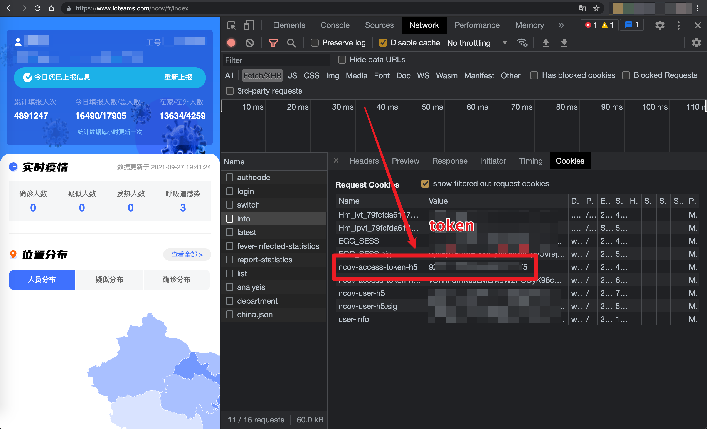

# ncovAutoReport
> 易统计批量自动打卡&amp;&amp;微信推送

## 0x00 使用方法

### 1. 下载到本地

```bash
# git clone https://github.com/FanqXu/ncovAutoReport
```

### 2. 安装依赖

```zsh
# pip3 install requests
```

### 3. 配置文件 *conf.ini*

```bash
# cd ncovAutoReport && cat conf.ini
92a3c5441023a43bvf5084f5:Fanq:SCU74835Fe67ee5e78c32d9e56e7dc68ebad908vc5e9e8cb7a97cc
```

以`:`分为三段，第一段为`92a3c5441023a43bvf5084f5`是个人「易统计」账号的token，有了这个token才可以打卡；第二段`Fanq`是名字，随便取；第三段`SCU74835Fe67ee5e78c32d9e56e7dc68ebad908vc5e9e8cb7a97cc`为个人Server酱的Key，是用于推送至WeChat的。



其中token和名字必须要有，而用于推送至WeChat的Server酱的key可有可无。

如下格式（表明Hz同学没有Server酱的key）也都行：

```bash
$ cat conf.ini
92a3c54410g3a43bvf5584f5:Fanq:SCU74835Fe67ee5e78c32d9e56e7dc68ebad908vc5e9e8cb7a97cc
a2a3c52410s3a43bvf5084f5:Hz:
```

### 4. Server酱配置（可选）

- https://sc.ftqq.com/3.version

使用GitHub的账号登录Server酱的网站就能获取一个key；然后绑定WeChat，也就是扫码关注他们的公众号就行了。具体操作去上方那个他们的网站去看。

实现功能的代码如下，其中`text`和`desp`中的内容可以自行修改。

```python
    def sendMsg(self, status):
        """
        通过Server酱推送至WeChat
        """
        if status == 'success':
            status = "今日打卡成功"
        payload = {
            'text': status,
            'desp': """
##### 提示：
    大约每2/3天需要登录一次打卡平台！
    （打开「易统计」微信小程序即可）
                    """}
        reqUrl = 'https://sc.ftqq.com/' + self.keys + ".send"
        push = requests.post(reqUrl, data=payload)
```

### 5. 手动运行

```bash
# python3 report.py
```

### 6. 自动化

使用Linux定时任务：

```bash
# crontab -e
00 9 * * * python3 /root/ncovAutoReport/report.py
```

查看定时任务：

```bash
# crontab -l
# m h  dom mon dow   command
00 9 * * * python3 /root/ncovAutoReport/report.py
```

每天早上九点自动执行`python3 /root/ncovAutoReport/report.py`这条命令。

## 0x01 注意事项

### 1. 打卡成功

如下图，两种状态均表明打卡成功。第一种「您今天已经创建过日报，无法再次创建」表明这是一种重复打卡，没事的。第二种「今日打卡成功」属于预期的结果。


### 2. 打卡失败

如下图表明打卡失败，原因可能是超过十天未登录「易统计」小程序，token临时失效。请登录小程序，顺便手动打一下卡。


### 3. 已知问题

大约十天不登录一次，token就会临时失效，请求`https://www.ioteams.com/ncov/api/users/last-report`这个接口就会报403。

所以目前是要求大约每十天需要登录一次！（打开「易统计」微信小程序即可）

另外这个程序是以请求上次打卡（昨天）提交的信息，来作为这一次（今天）所需要提交的信息。

提交的信息如下图：


也就是说当离开一个地方去另一个地方，需要暂停使用这个程序一天。那一天自己手动打卡以后再使用这个程序。

另外身体异常者不要使用。


